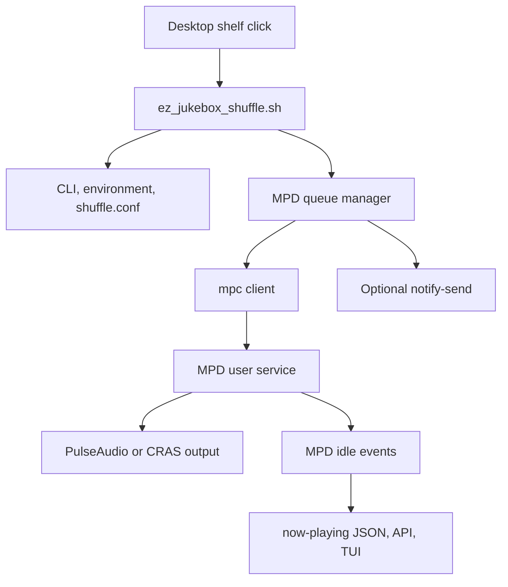
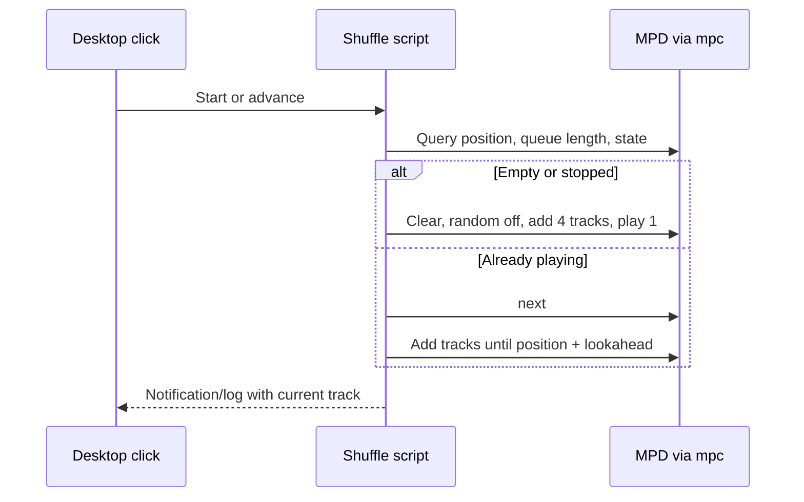

# ez_jukebox v1.0.0

Local-first music library automation for Linux and ChromeOS Crostini. The
project combines MPD playback, a low-latency audio configuration, library
intake and integrity tools, duplicate triage, playlist helpers, notifications,
and a one-click desktop shuffle launcher.

## What It Does

- Plays a local `~/Music-library` through MPD and `mpc`.
- Starts background random playback from a pinned Linux desktop icon.
- Maintains a configurable lookahead queue, defaulting to three upcoming tracks.
- Imports staged audio, rebuilds an XDG data manifest, and updates MPD on demand.
- Finds duplicates and orphans with reversible or dry-run-oriented tooling.
- Exposes now-playing data to notifications, a local API, and a terminal widget.
- Tunes buffering and gapless playback for Crostini scheduling jitter.

This is not a bit-perfect audio stack: ChromeOS CRAS/PulseAudio may resample
container audio to its system mix. The project optimizes the controllable parts
of playback without pretending to bypass that limitation.

## Release Scope

Version 1.0 supports local MPD playback, one-click shuffle, staged library
intake, manifest-based integrity checks, duplicate triage, playlist helpers,
now-playing integrations, and Crostini-oriented audio tuning. The supported
runtime is Bash and Python around a user-scoped MPD service. Historical tray
and unverified dedup experiments remain under `scripts/_archive/` and are not
part of the release path.

## Requirements

On the target Linux or Crostini system, install or provide:

- Python 3
- Bash, `find`, `rsync`, `shuf`, and `flock`
- MPD and the `mpc` client
- `systemd --user` for service management
- `notify-send` for optional desktop feedback
- `just` for the documented command shortcuts
- `shellcheck` for CI/static shell analysis

The repository itself can run offline shuffle tests without a live MPD server,
audio device, D-Bus session, or removable media mount.

On Debian or Ubuntu, the common packages are:

```bash
sudo apt install bash coreutils findutils rsync mpd mpc libnotify-bin just shellcheck python3 python3-mutagen
```

`mutagen` is needed by metadata and quarantine tools; the core shuffle test
does not need it.

## Install

Clone the repository and enter it:

```bash
git clone https://github.com/tangleroot013/ez_jukebox.git
cd ez_jukebox
```

Create the library directory and configure MPD. The setup script writes a
user-local configuration, backs up an existing one, detects the Pulse/CRAS
socket, selects the best available resampler, and restarts MPD when possible:

```bash
bash mpd_audiophile_setup.sh
```

The setup script writes `~/.mpd/mpd.conf` and creates `~/Music-library`. The
tracked [config/mpd.conf](config/mpd.conf) is a reference configuration for
the same playback policy; adapt paths if your MPD service uses
`~/.config/mpd` instead. Runtime manifests and reports live under
`${XDG_DATA_HOME:-~/.local/share}/ez_jukebox/`; they are not repository files.

Import existing music, or place new files in `~/Music/incoming` and run:

```bash
just intake
```

Install the desktop shuffle launcher:

```bash
bash scripts/install_shuffle_launcher.sh
```

Find **EZ Jukebox Shuffle** in the application menu and pin it to the shelf,
taskbar, or favorites. The installer is self-locating and uses XDG paths for
the application entry and icon.

Confirm the installation before first playback:

```bash
just preflight
mpc status
```

## Use

### One-click shuffle

The first icon click clears the managed queue, adds four random library files,
and starts playback. Each later click advances to the next track and adds only
enough new files to keep three tracks ahead. Clicks are serialized with `flock`
so rapid clicks cannot corrupt queue state.

```bash
bash scripts/ez_jukebox_shuffle.sh --help
bash scripts/ez_jukebox_shuffle.sh --lookahead 3
```

Configuration precedence is CLI flags, environment variables, config file,
then defaults. The optional file is:
`~/.config/ez_jukebox/shuffle.conf`.

```bash
MPD_HOST=localhost
MPD_PORT=6600
PRELOAD_COUNT=3
```

The launcher honors `XDG_CONFIG_HOME` and `XDG_DATA_HOME`, strips passwords
from `MPD_HOST` before diagnostics, and logs to
`~/.local/share/ez_jukebox/shuffle.log`.

On the first real icon click, the launcher runs
`mpd_audiophile_setup.sh` once and records completion at
`~/.local/share/ez_jukebox/audio-setup-v1.done`. Later clicks do not rewrite
the MPD configuration or restart the service. Set
`EZ_JUKEBOX_SKIP_AUDIO_SETUP=1` for an offline test or controlled deployment.

### Common commands

| Command | Purpose |
| --- | --- |
| `just status` | Show MPD and audio service status. |
| `just start` / `just stop` / `just restart` | Control the user audio services. |
| `just intake` | Import staged files, rebuild the XDG manifest, and run `mpc update`. |
| `just mix "Jazz"` | Build a 25-track smart mix. |
| `just notify` | Run the now-playing notification daemon. |
| `just now-playing` | Export now-playing JSON on MPD player events. |
| `just now-playing-api` | Serve now-playing JSON on localhost. |
| `just tui` | Launch the terminal now-playing widget. |
| `just export-playlists` / `just import-playlists` | Back up or restore MPD playlists. |
| `just sleep 45` | Start a playback sleep timer. |
| `just backup` | Run the local backup helper. |
| `just tag-lint` | Audit common music metadata fields. |
| `just dedup-policy` | Recommend duplicate retention decisions. |
| `just dedup-execute` | Run manifest-driven dedup in dry-run mode. |
| `just dedup-execute-live` | Apply dedup quarantine moves with `EXECUTE=1`. |

## Audio Integrity And Resource Use

The tracked [config/mpd.conf](config/mpd.conf) disables continuous library
rescans to reduce idle CPU and wakeups. Run `mpc update` after adding or
removing files; `just intake` already does this. The canonical manifest is
`${XDG_DATA_HOME:-~/.local/share}/ez_jukebox/music_manifest.json`, and
`just check-integrity` fails when it is missing or malformed. Playback keeps gapless MP3
transitions, ReplayGain metadata handling, software volume control, buffering,
and an internal resampler.

Crostini cannot guarantee real-time scheduling, CPU pinning, or exclusive
audio. Increase buffering only when skips occur, because larger buffers trade
latency for resilience. Inspect the active stack with:

```bash
just verify-audio-buffers
just stress-test-audio
htop -d 2 -p $(pgrep -d, -f 'mpd|pipewire|wireplumber')
```

## Architecture



### Shuffle queue flow



The lookahead calculation is:

$$\text{upcoming} = \text{queue length} - \text{current position}$$

Tracks are selected explicitly and random mode is kept off so MPD does not
silently reorder the managed queue.

## Verification

Run the portable checks first:

```bash
just test-shuffle
just verify-shuffle
```

The stateful mock test verifies cold start, immediate playback, second-click
refill, CLI lookahead handling, and credential-safe output. CI runs it on every
push and pull request targeting `main` or `master`, along with ShellCheck:
[.github/workflows/test.yml](.github/workflows/test.yml).

The environment-dependent pipeline is:

```bash
just verify
```

It checks the generated integrity and duplicate reports, the configured media
path, disk space, and MPD service status. It requires the configured local
library and media mount.

## Repository Structure

The following is the complete tracked source tree. Descriptions are inline so
the tree doubles as a file map.

```text
.
├── .github/
│   ├── prompts/optimize-audio-resources.prompt.md  # Reusable prompt for resource/fidelity work.
│   └── workflows/test.yml                          # CI: ShellCheck plus offline shuffle test.
├── assets/ez_jukebox_icon.png                      # Desktop launcher icon.
├── bin/jukebox                                     # CLI dispatcher for playback and library tools.
├── config/
│   ├── ez-jukebox-notify.service                   # User systemd unit for notifications.
│   ├── ez-jukebox-now-playing-api.service          # User systemd unit for local now-playing API.
│   ├── mpd.conf                                    # Tracked MPD playback/resource configuration.
│   └── ncmpcpp/config                              # ncmpcpp terminal player configuration.
├── duplicates.txt                                  # Duplicate-group input/report artifact.
├── justfile                                        # Project command recipes and orchestration.
├── justfile.bak                                    # Backup copy of the command recipes.
├── mpd_audiophile_setup.sh                         # Creates tuned user MPD configuration.
├── project.json                                    # Project manifest, entrypoints, artifacts, and conventions.
├── scripts/
│   ├── _archive/
│   │   ├── configure_tray_launcher.py              # Archived tray launcher configuration attempt.
│   │   ├── dedup_executor_stub_incomplete.py       # Incomplete archived dedup executor stub.
│   │   ├── dedup_fast_UNVERIFIED_cartermedia_path.py # Unverified hard-coded-path dedup script.
│   │   ├── fix_gtk_loop.py                          # Archived GTK event-loop fix attempt.
│   │   ├── fix_gtk_tray.py                          # Archived GTK tray fix attempt.
│   │   ├── fix_tray_click_random.py                 # Archived tray-click randomization patch.
│   │   ├── fix_tray_handler.py                      # Archived tray handler patch.
│   │   ├── patch_monitor_deep.py                    # Archived monitor patcher.
│   │   ├── update_monitor_tray.py                   # Archived monitor tray updater.
│   │   └── update_tray_shuffle.py                   # Archived tray shuffle updater.
│   ├── apply_lowlatency.sh                         # Applies low-latency audio tuning.
│   ├── atomic_fix.sh                               # Historical atomic service/config repair helper.
│   ├── audiophile_tune.sh                          # Applies audio quality and stability tuning.
│   ├── auto_import_downloads.sh                    # Watches/imports downloaded audio.
│   ├── bluetooth_audio_switch.sh                   # Switches Bluetooth audio output.
│   ├── bluetooth_watchdog.py                       # Monitors Bluetooth/Pulse audio health.
│   ├── boost_mpd_priority.sh                       # Adjusts MPD process priority.
│   ├── check_integrity.py                          # Validates the canonical XDG manifest and writes a report.
│   ├── clean_storage.sh                            # Cleans managed storage artifacts.
│   ├── crostini_audio_priority.sh                  # Applies Crostini audio process priorities.
│   ├── dedup_executor.py                           # Manifest-driven reversible dedup executor.
│   ├── dedup_triage.py                              # Generates duplicate triage JSON/HTML reports.
│   ├── dedupe_justfile.py                           # Generates or updates dedup recipes.
│   ├── ensure_audio_group.sh                        # Ensures audio-group membership.
│   ├── ez_backup.sh                                 # Runs the local backup workflow.
│   ├── ez_dedup_policy.py                           # Recommends duplicate retention policy decisions.
│   ├── ez_find_orphans.sh                           # Finds files absent from the manifest.
│   ├── ez_intake.sh                                 # Imports staged audio and updates MPD.
│   ├── ez_jukebox_shuffle.sh                        # One-click MPD queue manager and launcher target.
│   ├── ez_mix.sh                                    # Builds a query-based smart mix.
│   ├── ez_notify.sh                                 # Event-driven now-playing notification/JSON daemon.
│   ├── ez_notify_test.sh                            # Tests notification daemon behavior.
│   ├── ez_now_playing.sh                            # Event-driven now-playing JSON exporter.
│   ├── ez_now_playing_api.py                        # Local HTTP API for now-playing JSON.
│   ├── ez_now_playing_tui.py                        # Terminal now-playing display.
│   ├── ez_playlists.sh                              # Exports/imports MPD playlists.
│   ├── ez_preflight.sh                              # Checks system/socket prerequisites.
│   ├── ez_sleep.sh                                  # Stops or sleeps playback after a timer.
│   ├── ez_tag_lint.py                               # Audits music metadata tags.
│   ├── find_orphans_manifest.py                     # Compares media files with manifest entries.
│   ├── install_shuffle_launcher.sh                  # Installs the XDG desktop launcher and icon.
│   ├── launch.sh                                    # General project launcher.
│   ├── launch_ez_jukebox.sh                         # Starts the ez_jukebox application workflow.
│   ├── monitor_jukebox.py                           # Historical monitor/tray implementation.
│   ├── mpd_auto_update.sh                           # MPD database update helper.
│   ├── mpd_cover_art_fetch.sh                       # Fetches cover art metadata/assets.
│   ├── mpd_log_level.sh                             # Adjusts MPD logging level.
│   ├── mpd_lyrics_fetch.sh                          # Fetches lyrics for current music.
│   ├── mpd_notify.py                                # Python MPD event notification helper.
│   ├── mpd_now_playing_json.sh                      # Writes MPD now-playing JSON.
│   ├── mpd_play_count.sh                            # Reports or updates play counts.
│   ├── mpd_play_fav.sh                              # Starts favorite tracks.
│   ├── mpd_play_genre.sh                            # Starts tracks by genre.
│   ├── mpd_play_last_hour.sh                        # Plays tracks from the recent hour.
│   ├── mpd_play_next.sh                             # Advances to the next MPD track.
│   ├── mpd_play_random.sh                           # Starts MPD random playback helper.
│   ├── mpd_play_starred.sh                          # Starts starred tracks.
│   ├── mpd_playback_history.sh                      # Reports playback history.
│   ├── mpd_playlist_backup.sh                       # Backs up MPD playlists.
│   ├── mpd_playlist_export.sh                       # Exports playlists to files.
│   ├── mpd_playlist_import.sh                       # Imports playlists into MPD.
│   ├── mpd_playlist_shuffle.sh                      # Shuffles an MPD playlist.
│   ├── mpd_replaygain_apply.sh                      # Applies ReplayGain operations.
│   ├── mpd_seek_percent.sh                          # Seeks by percentage through a track.
│   ├── mpd_skip_dupes.sh                            # Skips duplicate tracks during playback.
│   ├── mpd_sleep_timer.sh                           # MPD-specific sleep timer.
│   ├── mpd_volume_sync.sh                           # Synchronizes MPD volume.
│   ├── mpd_web_ui.py                                # Lightweight MPD web UI.
│   ├── mpd_web_ui_toggle.sh                         # Enables or disables the web UI.
│   ├── music_lyrics_watcher.sh                      # Watches music and lyrics changes.
│   ├── music_mgr.sh                                 # General music-management helper.
│   ├── power_button_hook.sh                         # Power-button playback hook.
│   ├── productionize.sh                             # Production setup/hardening helper.
│   ├── quarantine_nonmusic.sh                       # Moves non-music files to quarantine.
│   ├── rebuild_manifest.py                          # Rebuilds the canonical XDG music manifest atomically.
│   ├── recover.py                                   # Recovery workflow for managed files.
│   ├── set_lid_behavior.sh                          # Configures lid behavior.
│   ├── setup_keyboard_shortcuts.sh                  # Installs playback keyboard shortcuts.
│   ├── show_hints.py                                # Displays command/use hints.
│   ├── sync_android_music.sh                       # Synchronizes Android music.
│   ├── trim_mpd_playlist.sh                        # Trims oversized MPD queues.
│   └── tune_audio_buffer.sh                         # Tunes playback buffer settings.
├── src/
│   ├── ez_jukebox/__init__.py                       # Python package marker.
│   ├── ez_jukebox/manifest.py                       # Manifest package helpers.
│   ├── ez_jukebox/paths.py                          # Shared path resolution helpers.
│   ├── bitrate_auditor.py                           # Audits track bitrates.
│   ├── build_manifest.py                            # Builds a library manifest.
│   ├── build_music_library.py                       # Builds/organizes the music library.
│   ├── cleanup_music_library.py                     # Cleans library files and structure.
│   ├── config_validator.py                          # Validates project/audio configuration.
│   ├── decay_scanner.py                             # Finds aging or stale library content.
│   ├── integrity_check.py                           # Core integrity-check implementation.
│   ├── music_manifest.json                          # Source-side manifest snapshot/artifact.
│   ├── optimize_playback.py                        # Playback optimization helper.
│   ├── organize_music.py                            # Organizes files by metadata.
│   ├── path_resolver.py                             # Resolves configured library paths.
│   └── sample_rate_sentinel.py                      # Audits sample-rate consistency.
├── test/verify_suite/
│   ├── run_verification.sh                          # Shell entrypoint for environment verification.
│   ├── test_shuffle.sh                              # Stateful offline MPD mock test.
│   └── verify_pipeline.py                           # Manifest, media, disk, and MPD checks.
├── .gitignore                                      # Ignores caches, logs, venvs, and generated manifest.
└── README.md                                       # This guide.
```

The `_archive/` directory contains these historical files: tray launcher
patchers, GTK loop fixes, an incomplete dedup stub, and the unverified
CarterMedia-path dedup script. They are retained for reference and are not
part of the supported runtime path.

## Roadmap

### Near term

- Add a real MPD integration test matrix for empty, stopped, paused, and
    nearly exhausted queues.
- Centralize shared XDG path and MPD connection handling across Bash scripts.
- Add atomic writes and schema validation for all now-playing JSON artifacts.
- Add a documented sample `shuffle.conf` without committing user credentials.

### Medium term

- Replace duplicated notification/export loops with one event-driven Python
    service or a shared library, after measuring its idle cost.
- Add systemd hardening and resource limits to the shipped user units.
- Add playlist and manifest backup retention policies.
- Add structured JSON event logs for queue transitions and recovery analysis.

### Longer term

- Add a small local control API only if the desktop launcher and existing
    `mpc` interface no longer cover the user workflow.
- Add measured audio regression tests across CRAS, PulseAudio, and PipeWire.
- Package the launcher and service files for repeatable installation on fresh
    Crostini containers.

## Bottlenecks And Tradeoffs

| Area | Current constraint | Practical response |
| --- | --- | --- |
| Crostini scheduling | Containers cannot guarantee real-time CPU scheduling or pinning. | Use buffering and event-driven operations; measure skips on the target device. |
| CRAS/PulseAudio | System audio may resample source material. | Preserve gapless/resampler quality, but do not claim bit-perfect output. |
| MPD database | Continuous scans cost idle CPU and I/O. | Keep `auto_update` off and run `mpc update` after intake. |
| Queue control | `mpc` is a process boundary for each operation. | Batch only where safe, keep the queue small, and serialize launcher clicks. |
| Metadata tools | Large libraries make full scans expensive. | Use manifests, targeted intake, and explicit maintenance commands. |
| Desktop integration | Shelf behavior varies across Linux desktops and Crostini. | Use a standard XDG `.desktop` entry and a portable icon path. |
| External services | Lyrics, cover art, and Bluetooth depend on network/device state. | Keep playback local and make auxiliary helpers optional. |

## Recovery And Troubleshooting

```bash
just preflight
systemctl --user status mpd --no-pager
journalctl --user -u mpd -n 100 --no-pager
mpc status
mpc stats
mpc update
```

If the icon is missing, rerun the installer and refresh the desktop menu. If
playback stutters, inspect buffer settings before changing process priorities.
If the queue behaves unexpectedly, inspect the launcher log and use
`mpc playlist` plus `mpc status` to compare active position and upcoming tracks.

## Contributing

Keep changes focused, preserve user data, and do not commit generated reports,
credentials, local media paths, or runtime logs. Add a stateful offline test
for queue behavior and run `just test-shuffle` before submitting changes.
